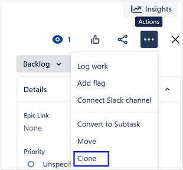

= Challenge 1

Your first challenge awaits! 

In this challenge, we want to get an idea of your writing style as it relates to software and computer technology.

== Instructions

. Choose any software or application that you use regularly.
. Write instructions on how to perform a common task related to the software or application.

.Example please?
****
Some ideas to get you started:

* Sending an attachment in link:https://signal.org/[Signal^].
* Forwarding an email with link:https://www.google.com/gmail/about/[Gmail^].
* Publishing a blog post with link:https://wordpress.com/[Wordpress^].
* Adding an extension to link:https://code.visualstudio.com/[Visual Studio Code^].
* Taking a screenshot with an link:https://www.apple.com/iphone/[iPhone^].
****

TIP: Keep the task concise. There's no need to over-complicate the instructions.

== Answer:

Instructions for cloning a JIRA issue

== Clone an issue

Sometimes it saves time to clone, or duplicate, an issue instead of starting from scratch.

Cloning automatically copies across certain information from the original issue to a new one, including the *Summary*, *Description*, and other details. You can also choose to copy across additional information, such as attachments, sprint values, and links.

[NOTE]
====
A cloned issue has a new key, e.g. DOC-2678, which means that you can update it without affecting the original issue.
====

To clone an issue:

.  Open the issue that you want to clone.
.  Select ··· *> Clone*.

.  In the *Summary* box, enter a short description for your new issue.
.  Select any additional information that you want to copy across.
.  Select *Clone*. A notification appears with a link to your new issue.

